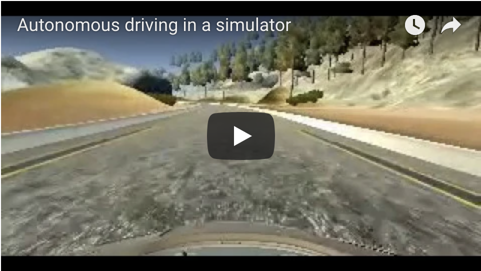

# **Behavioral Cloning** 

---

**Behavioral Cloning Project**

The goals / steps of this project are the following:
* Use the simulator to collect data of good driving behavior
* Build, a convolution neural network in Keras that predicts steering angles from images
* Train and validate the model with a training and validation set
* Test that the model successfully drives around track one without leaving the road
* Summarize the results with a written report


[//]: # (Image References)

[image2]: ./images/center_driving_1.jpg "Center Driving"
[image3]: ./images/recovery_1.jpg "Recovery Image"
[image4]: ./images/recovery_2.jpg "Recovery Image"
[image5]: ./images/recovery_3.jpg "Recovery Image"
[image6]: ./images/flip1.jpg "Normal Image"
[image7]: ./images/flip2.jpg "Flipped Image"

## Rubric Points
### Here I will consider the [rubric points](https://review.udacity.com/#!/rubrics/432/view) individually and describe how I addressed each point in my implementation.  

---
### Files Submitted & Code Quality

#### 1. Submission includes all required files and can be used to run the simulator in autonomous mode

My project includes the following files:
* model.py containing the script to create and train the model
* drive.py for driving the car in autonomous mode
* model.h5 containing a trained convolution neural network 
* README.md summarizing the results

#### 2. Submission includes functional code
Using the Udacity provided simulator and my drive.py file, the car can be driven autonomously around the track by executing 
```bash
python drive.py model.h5
```
Alternatively, using the docker image
```bash
docker run -it --rm -p 4567:4567 -v `pwd`:/src udacity/carnd-term1-starter-kit python drive.py model.h5
```

#### 3. Submission code is usable and readable

The model.py file contains the code for training and saving the convolution neural network. The file shows the pipeline I used for training and validating the model, and it contains comments to explain how the code works.

### Model Architecture and Training Strategy

#### 1. An appropriate model architecture has been employed

My model is based off a network architecture [published](https://devblogs.nvidia.com/deep-learning-self-driving-cars/) by NVIDIA. 
My model consists a normalization layer (code line 66); a cropping layer that removes parts of the camera image that are not of interest (code line 67);
It includes five convolutional layers (three 5x5 kernel and 2 3x3 kernel) (code lines 69 - 82) and three fully connected layers (code lines 87 - 95)
 

#### 2. Attempts to reduce over-fitting in the model

The model was trained and validated on different data sets to ensure that the model was not overfitting. The model was tested by running it through the simulator and ensuring that the vehicle could stay on the track.
After repeated attempts, I added Dropout layers and some non-linear activations to the Fully-connected layers (except the last) to make my car stay on track.

#### 3. Model parameter tuning

The model used an adam optimizer, so the learning rate was not tuned manually (model.py line 98).

#### 4. Appropriate training data

Training data was chosen to keep the vehicle driving on the road. I used a combination of center lane driving, recovering from the left and right sides of the road ... 

For details about how I created the training data, see the next sections. 


### Model Architecture and Training Strategy

#### 1. Solution Design Approach

The overall strategy for deriving a model architecture was to ...

My first step was to use a convolution neural network model similar to the ... I thought this model might be appropriate because ...

In order to gauge how well the model was working, I split my image and steering angle data into a training and validation set. I found that my first model had a low mean squared error on the training set but a high mean squared error on the validation set. This implied that the model was overfitting. 

The final step was to run the simulator to see how well the car was driving around track one. There were a few areas where the vehicle went unnecessarily close to the edge of the track. To improve the driving behavior in these cases, I collected more recovery driving data that helped network deal with such scenarios. 

At the end of the process, the vehicle is able to drive autonomously around the track without leaving the road.

More improvements could be made to make for smoother driving, by exploring Dropout layers to reduce overfitting.

#### 2. Final Model Architecture

The final model architecture (model.py lines 62-95) consisted of a convolution neural network with the following layers and layer sizes.
* Three 5x5 kernel convolutional layer with a 2x2 stride
* Two non-strided  3x3 kernel convolutional layer.
* Three fully connected layers ()with Dropouts).

#### 3. Creation of the Training Set & Training Process

To capture good driving behavior, I first recorded three laps on track one using center lane driving. Here is an example image of center lane driving:

![Center Driving][image2]

I recorded two laps of the driving on the track in the reverse direction.

I then recorded the vehicle recovering from the left side and right sides of the road back to center so that the vehicle would learn to recover from the edges of the road. These images show what a recovery looks like starting from ... :

![Recovery1][image3]
![Recovery2][image4]
![Recovery3][image5]

To augment the data sat, I also flipped images (at runtime) and steering angles to provide additional images (training points). For example, here is an image that has then been flipped:

![Normal Image][image6]
![Flipped Image][image7]


I collected a total of 28332 images from the car's three cameras (9444 from each of the cameras). I augmented by flipping each image.
After the collection/augmentation process, I had 56664 number of data points.


I finally randomly shuffled the data set and put 20% of the data into a validation set. 

I used this training data for training the model. The validation set helped determine if the model was over or under fitting. I found out that 3 epochs was ideal for my model. I used an adam optimizer so that manually training the learning rate wasn't necessary.

#### Video Output
[](https://youtu.be/wI2jJV2xDJ4)
